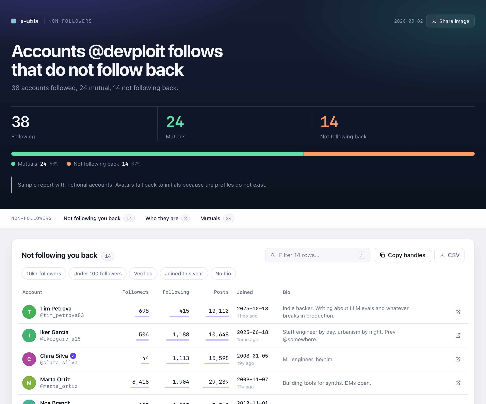
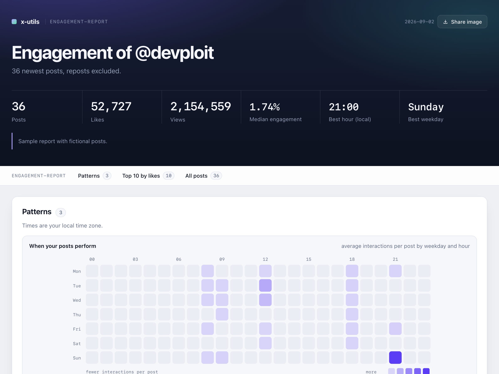
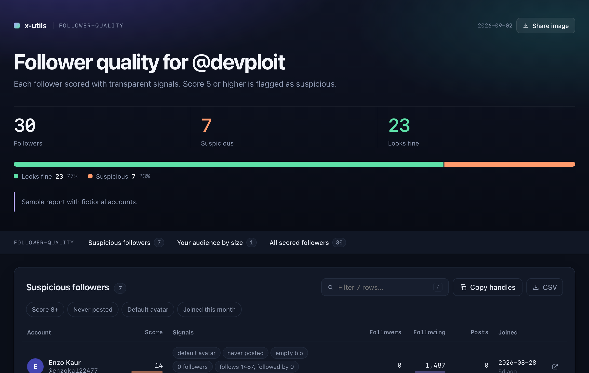
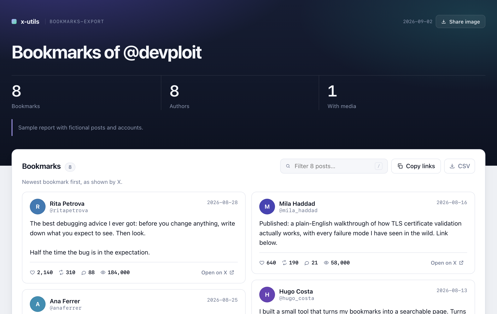

<div align="center">

# x-utils

**See who does not follow you back on X. Find out which of your posts actually work. Export your bookmarks. Spot fake followers.**

Free, in about a minute, without paying for X's API, giving anyone your password or installing anything.

[](https://github.com/devploit/x-utils/actions/workflows/ci.yml)
[](LICENSE)




**[Open the live examples and copy a tool from the website](https://x-utils.com/)**

</div>

## The idea

Everything these tools show you is already on your screen when you scroll through X. The "Follows you" badge, the follower counts, your bookmarks, the dates. Nobody has time to scroll through 800 accounts and take notes, so people pay for apps that ask for access to their account, or for an API that costs more than a car payment.

x-utils does the scrolling for you, inside your own browser tab, and hands you a report. It never sees your password, never talks to any server, and never changes anything on your account. When it finishes, you have a page you can sort and search, plus a spreadsheet, and nothing has left your computer.

## Start here

Twelve tools are in the box. These two are the ones people run first, and the ones they screenshot.

### Who does not follow you back

You follow 800 accounts. How many of them follow you? X will not tell you, and the apps that will want access to your account. **Non-followers** scrolls your following list, reads the "Follows you" badge and the relationship data behind it, and gives you the list with each account's size, age and bio, so you can decide in a glance who stays. It also stores a snapshot, so **Followers diff** can tell you next month exactly who left. That is the report at the top of this page.

### Which of your posts actually work

<div align="center">

</div>

X shows you the numbers one post at a time and never adds them up. **Engagement report** reads your newest posts and answers the questions that matter:

- Which posts got the most likes, the most views, and the best ratio between the two.
- Your median engagement rate, so a viral outlier does not fool you about how a normal post performs.
- The hour and weekday your posts historically do best, measured on your own account rather than on a blog's advice.
- Totals and medians for likes, reposts, replies and views, ready for a spreadsheet.

It works on any public profile, not only yours, which makes it a quiet way to study the accounts you admire.

## Try it in one minute

You need a computer with Chrome, Edge, Brave, Arc or Firefox, and to be logged in to X. Phones do not work for this, because they have no developer console.

1. **Open the page the tool needs.** For "who does not follow me back" that is `https://x.com/YOUR_HANDLE/following` (replace `YOUR_HANDLE` with yours).
2. **Open the browser console.** Press `F12` on Windows or Linux, `Cmd + Option + I` on a Mac, then click the tab called **Console**.
3. **Copy the tool.** Easiest from the [website](https://x-utils.com/#start): pick the tool and press "Copy the script". On GitHub, open [`dist/non-followers.js`](dist/non-followers.js) and use the copy icon at the top right of the file.
4. **Paste it into the console and press Enter.** The first time, Chrome refuses and asks you to type `allow pasting`. Type exactly that, press Enter, and paste again. This is Chrome protecting you from pasting code you have not read, which is a good habit.
5. **Wait.** A small panel appears in the corner of the page with the progress, and the page scrolls by itself. Keep the tab in front. When it is done, the panel shows the result and a **Preview (read-only)** button. The interactive report is saved to your Downloads folder as `x-utils_non-followers_YOUR_HANDLE_DATE.html`, next to a CSV and a JSON.

That is the whole thing. Every other tool works exactly the same way: open the right page, paste the right file.

> **Is pasting code into the console safe?** It is safe when you know what the code does, and dangerous when you do not, which is why Chrome asks. These files are short, plain JavaScript that anyone can read, they only read what the page shows, and they contain no addresses to send data to. If you want to check, search a file for `http` and you will find only links to x.com and the standard `w3.org` namespace that every SVG icon carries. The [For developers](#for-developers) section explains how the code is built.

## What it can do

Every tool is read-only. None of them follows, unfollows, blocks, likes, posts or deletes anything.

### Your relationships

| Tool | Open this page first | You get |
| --- | --- | --- |
| [**Non-followers**](dist/non-followers.js) | `x.com/YOU/following` | Who you follow that does not follow you back, with how big and how old each account is. |
| [**Fans**](dist/fans.js) | `x.com/YOU/followers` | Who follows you that you do not follow back. |
| [**Followers diff**](dist/followers-diff.js) | `x.com/YOU/followers` | Run it today, run it again next month: who unfollowed you, who is new, who changed their name. The feature every "who unfollowed me" app charges for. |
| [**Inactive following**](dist/inactive-following.js) | `x.com/YOU/following` | Accounts you follow that have not posted in six months, or ever. By default only the ones that do not follow you back; set `onlyNonFollowers` to `false` to check everyone. X allows about 50 profile checks every 15 minutes, so a long list runs in batches with pauses; the tool waits and resumes on its own. |
| [**Follower quality**](dist/follower-quality.js) | `x.com/YOU/followers` | Every follower scored with bot signals: default avatar, never posted, brand-new account, follows thousands and is followed by three. Suspicious ones first, and it tells you why. |
| [**Blocked and muted export**](dist/blocked-muted-export.js) | `x.com/settings/blocked/all` | Your blocked or muted lists as a file, so they exist somewhere X cannot take away. |

### Your content

| Tool | Open this page first | You get |
| --- | --- | --- |
| [**Engagement report**](dist/engagement-report.js) | `x.com/YOU` | Your recent posts ranked by likes, views and engagement rate, plus totals, medians and the hour and weekday your posts do best. Works on any public profile. |
| [**Bookmarks export**](dist/bookmarks-export.js) | `x.com/i/history` | Every bookmark as a readable page, a Markdown file for your notes app, and a spreadsheet. With text, author, date, metrics and media links. |
| [**Likes export**](dist/likes-export.js) | `x.com/i/history/likes` | The same for everything you liked. |
| [**Thread unroll**](dist/thread-unroll.js) | any post in a thread | The whole thread as clean text and Markdown, from any post in it. |
| [**Search export**](dist/search-export.js) | `x.com/search?q=...` | Any search, including advanced operators, as a spreadsheet. |
| [**List members export**](dist/list-members-export.js) | `x.com/i/lists/ID/members` | Everyone on any List, flagged with whether you follow them and whether they follow you. |

## What you get

<div align="center">

</div>

Every tool writes the same set of files to your Downloads folder, named `x-utils_TOOL_SUBJECT_DATE`:

- **An HTML report** built for reading. It opens in any browser, works offline, and follows your light or dark mode. The header says the result in one sentence with a proportion bar, and a **Share image** button turns that header into a 1200x630 picture ready to post. A sticky bar lists the sections. Charts are drawn where they say something: a heatmap of when your posts perform, likes and views per post, the size of the accounts in a list, and your follower count across snapshots. Tables show every account with avatar, name and handle, sort when you click a column, filter as you type (press `/`) or with one-click chips such as "10k+ followers" or "Joined this year", and draw a small bar under every number so the outliers jump out. Two buttons copy the handles or download a CSV of exactly the rows you filtered. Posts appear as cards with the text, media and metrics.
- **A CSV** for Excel, Numbers or Google Sheets.
- **A JSON** with every field, for anyone who wants to do more with the data.
- **Markdown** for the content tools, ready to paste into Obsidian, Notion or a blog.

<div align="center">

</div>

Want to see the format before running anything? The samples are live on the [website](https://x-utils.com/#examples), built from fictional data: [non-followers](https://x-utils.com/docs/examples/non-followers.html), [engagement report](https://x-utils.com/docs/examples/engagement-report.html), [followers diff](https://x-utils.com/docs/examples/followers-diff.html), [follower quality](https://x-utils.com/docs/examples/follower-quality.html), [bookmarks](https://x-utils.com/docs/examples/bookmarks-export.html). The same files are in [`docs/examples/`](docs/examples/).

## Questions people ask

**Do I need to install something?** No. Nothing is installed, no extension, no app, no account. You paste a text file into a panel your browser already has.

**Does it need my password or an API key?** No. It runs inside the tab where you are already logged in and reads what that tab shows. It does not read your cookies or tokens, and it opens no connection of its own.

**Where does my data go?** Nowhere. The files are written straight to your Downloads folder. There is no server, no analytics, no "sign in to see results".

**Can it get me banned?** It reads pages you can already see, at a pace slower than a person scrolling fast, and changes nothing. X sometimes pauses very long lists with a "Something went wrong" message; the tools notice, wait with growing pauses (shown as a countdown in the panel) and retry, and if X keeps refusing they stop and keep what they have, so you can run again 15 minutes later. If you have tens of thousands of followers, run with a limit or in several sessions. That said, this is not an official X product and you use it on your own account at your own discretion.

**How long does it take?** A few hundred accounts or posts take about a minute; a thousand, a few minutes. With several thousand followers X pauses the list every so often for minutes at a time. On followers and following pages the tool reads the total from your profile header and tells you what to expect before it starts, waits through the pauses with a countdown, and keeps partial results if X refuses for good. Keep the tab open and in front.

**Why is it free when apps charge for this?** Because the expensive part, the X API, is not used. The web page already downloads everything; the tools just read along.

**Will it break?** Eventually, when X redesigns its web app, some tool will stop finding what it looks for. The code is written to survive most changes, and when it breaks, it says so in the console instead of giving you a wrong answer. Open an issue with the tool name and what it printed.

**My X is not in English.** Badges and buttons are recognised in English, Spanish, French, German, Italian, Portuguese and a few more. If yours is another language, switch X to English for the run.

**The first page of results has less detail.** The page loads its first batch before you paste the tool, so those rows have fewer fields unless the tool can refresh them by switching tabs, which it tries to do. The console tells you how many rows were affected.

**Nothing downloaded.** Look for your browser asking permission to download several files at once, and allow it. Everything is also kept in the console under `window.xu.last`.

## Tweak a run

The first lines of every file are a `CONFIG` block with plain-English comments. You can change them before pasting. The useful ones:

| Setting | What it does |
| --- | --- |
| `outputs` | Which files to write, for example `["html", "csv"]`. |
| `maxUsers` or `maxTweets` | Stop after this many, handy for a quick first look at a huge list. |
| `scrollDelayMs` | How long to wait between scrolls. Raise it if X keeps showing "Something went wrong". |
| `inactiveMonths`, `suspiciousScore` and friends | The thresholds each tool uses to decide what to flag. |

## If it helped

Star the repository so more people find it, and press **Share image** at the top of your report: it saves a 1200x630 picture with the result in one sentence, the numbers and the bar, and nothing else. Post it with a link to this page. Personal data in the tables is other people's public profile information, so treat the files with the same care you would want for yours, and do not commit them anywhere public.

## For developers

<details>
<summary><strong>How it works</strong></summary>

Each tool is one self-contained JavaScript file. When pasted, it:

1. Checks that it is on x.com and on the page it expects, and refuses otherwise.
2. Observes the JSON responses the X web client fetches while scrolling (GraphQL and legacy REST), by wrapping `fetch` and `XMLHttpRequest` in the tab. Those responses carry IDs, counts, dates and relationship flags for every account or post. The wrapper is removed when the tool finishes.
3. Auto-scrolls the timeline and reads the rendered cells as the source of truth for membership and order, enriching them with the observed JSON. Users and tweets are located by walking the whole JSON for objects that look like them rather than by hard-coded paths, which survives most layout changes.
4. Analyses, prints a summary and a `console.table`, renders the HTML report, writes the files with Blob downloads and leaves the result on `window.xu.last`.

The first page of any list is loaded by X before the tool is pasted, and X serves it from its own cache afterwards, so the interceptor never sees it. To complete those rows the tool re-issues the very same list request the page already made (same endpoint, same headers), without the pagination cursor, and follows cursors until the rows on screen are covered. Beyond that, no request is made that the page would not make on its own.

**Diagnostics.** After a run, `window.xu.debug` holds one raw user object, one raw post object and the HTML of one list cell exactly as X sent them, plus counters for the phases above. Nothing of this is written to any file; it exists so that when X changes its format, a user can run `copy(JSON.stringify(xu.debug))` and paste the result in an issue, and the console tells them to do exactly that when it notices missing counts, names or metrics. The captured objects are public profile and post data, never credentials.

</details>

<details>
<summary><strong>Repository layout, build and tests</strong></summary>

```
src/lib/      shared runtime, inlined into every tool (logging, progress panel, scrolling, interception, parsing, export, HTML report, charts)
src/tools/    one source file per tool: metadata header, CONFIG block, body
scripts/      build.mjs assembles dist/ and syntax-checks every output; examples.mjs renders the sample reports
dist/         generated, paste-ready files (committed so users need nothing but a browser)
tests/        node:test unit tests for the pure functions and a smoke test of the built files
docs/         design notes, sample reports, screenshots, social preview source
index.html    the landing page (copy buttons fetch dist/ from the same origin)
.github/      CI (build, test, verify dist/ and examples are fresh) and release on v* tags
```

Hosting: the site is static, so any host works. It runs on Cloudflare Pages: connect the repository, no build command, output directory `/`, and attach the domain in the Cloudflare dashboard. The landing page, the sample reports and the `dist/` files are then served from `https://x-utils.com/`; the "Copy script" buttons fetch `dist/` from that same origin.

Releases: tag a commit `vX.Y.Z` after updating `CHANGELOG.md`; the release workflow builds, tests, zips `dist/` and publishes a GitHub release with the changelog section as notes.

Requirements: Node 20 or newer. No runtime or development dependencies.

```bash
npm run build      # regenerate dist/ from src/
npm test           # unit tests + dist smoke tests
npm run check      # both
npm run examples   # regenerate docs/examples/ from fictional data
```

The HTML report was also checked with headless Chrome: screenshots in light, dark and 390 px widths, and a harness that exercises sorting, filtering, the `/` shortcut, the section bar and the export buttons on a real rendered report.

</details>

<details>
<summary><strong>Adding a tool</strong></summary>

Create `src/tools/<name>.js` with three header lines (`// @name`, `// @description`, `// @page`), a `CONFIG` block between `// == CONFIG ==` and `// == END CONFIG ==`, and a body that uses the runtime helpers: `collectUserList` or `collectTweetTimeline` to gather, `renderHtmlReport` with `htmlTableSection` or `htmlCardsSection` for the report, `toCsv`, `toJson`, `writeOutputs`, `printTable` and `publishResult`. Run `npm run build` and the file appears in `dist/`. Keep everything in English, keep tools read-only unless they implement an explicit dry-run, and add a unit test for any pure function you touch.

</details>

<details>
<summary><strong>Limitations</strong></summary>

- Selectors (`data-testid` attributes) and JSON shapes belong to X and change without notice. The DOM fallback and the generic JSON walk reduce the blast radius, not to zero.
- The first page of a list is loaded before the tool runs. `bounceTabs()` re-fetches it where a sibling tab exists; otherwise those rows are DOM-only and reported as such.
- `inactive-following` needs each account's newest post, which no list view provides, so it re-issues the profile timeline request X itself makes when a profile is opened, once per account. X refuses to be framed, so a popup window is the only fallback.
- Badge and button texts are matched by regular expressions per language, in `src/lib`.

</details>

## Roadmap

The next batch adds tools that change things, each with a mandatory dry-run, conservative pacing and a confirmation step: bulk unfollow from a handle list (for example the output of Non-followers or Inactive following), bulk block and mute import from CSV, adding accounts to a List in bulk, and deleting old posts or removing likes using the IDs from your X data archive.

## Contributing

Bug reports with the tool name, the page URL pattern and what the console printed are the most useful thing you can send. Pull requests should keep the zero-dependency rule, add or update a unit test for any pure function they touch, and regenerate `dist/`.

## Disclaimer

This project is not affiliated with, endorsed by or supported by X Corp. It automates reading pages you can already see while logged in. Use it on your own account, respect the platform's terms of service and other people's privacy, and expect breakage whenever X ships a redesign.

## License

[MIT](LICENSE)
